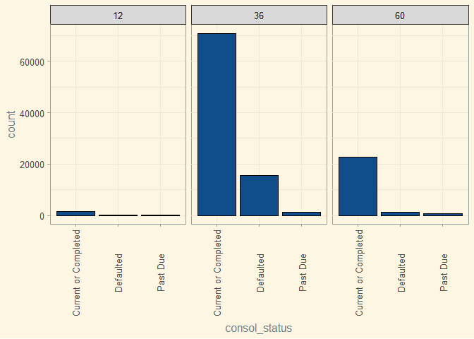

Explore Prosper Loan Porfolio by Hao Lee
========================================================


#Data wrangling
#####This data set is 128mb large, and is split into 3 files. Before starting, I will join all three files, and create a sample data set to test code with. 


 
**Context**

#####This data set is from Prosper loan. Prosper is a peer to peer lending company that offers personal loans at low rates. These loans are unsecured, which means borrowers do not have to put up any collateral. Each loan is funded by multiple peoplpe all over the US. Prosper loan has been in business since 2005.

#####This data set contains 113,937 loans with 81 variables on each loan, including loan amount, interest rate, current loan status, borrower income, employment, stsatus, credit history, and latest payment.


# Univariate Plots Section

#####In this section, I am doing preliminary exploration of the Prosper loan dataset, and getting a sense of the distribution of the variable before going further. 


```
## 'data.frame':	113937 obs. of  81 variables:
##  $ ListingKey                         : Factor w/ 113066 levels "00003546482094282EF90E5",..: 7180 7193 6647 6669 6686 6689 6699 6706 6687 6687 ...
##  $ ListingNumber                      : int  193129 1209647 81716 658116 909464 1074836 750899 768193 1023355 1023355 ...
##  $ ListingCreationDate                : Factor w/ 113064 levels "2005-11-09 20:44:28.847000000",..: 14184 111894 6429 64760 85967 100310 72556 74019 97834 97834 ...
##  $ CreditGrade                        : Factor w/ 9 levels "","A","AA","B",..: 5 1 8 1 1 1 1 1 1 1 ...
##  $ Term                               : int  36 36 36 36 36 60 36 36 36 36 ...
##  $ LoanStatus                         : Factor w/ 12 levels "Cancelled","Chargedoff",..: 3 4 3 4 4 4 4 4 4 4 ...
##  $ ClosedDate                         : Factor w/ 2803 levels "","2005-11-25 00:00:00",..: 1138 1 1263 1 1 1 1 1 1 1 ...
##  $ BorrowerAPR                        : num  0.165 0.12 0.283 0.125 0.246 ...
##  $ BorrowerRate                       : num  0.158 0.092 0.275 0.0974 0.2085 ...
##  $ LenderYield                        : num  0.138 0.082 0.24 0.0874 0.1985 ...
##  $ EstimatedEffectiveYield            : num  NA 0.0796 NA 0.0849 0.1832 ...
##  $ EstimatedLoss                      : num  NA 0.0249 NA 0.0249 0.0925 ...
##  $ EstimatedReturn                    : num  NA 0.0547 NA 0.06 0.0907 ...
##  $ ProsperRating..numeric.            : int  NA 6 NA 6 3 5 2 4 7 7 ...
##  $ ProsperRating..Alpha.              : Factor w/ 8 levels "","A","AA","B",..: 1 2 1 2 6 4 7 5 3 3 ...
##  $ ProsperScore                       : num  NA 7 NA 9 4 10 2 4 9 11 ...
##  $ ListingCategory..numeric.          : int  0 2 0 16 2 1 1 2 7 7 ...
##  $ BorrowerState                      : Factor w/ 52 levels "","AK","AL","AR",..: 7 7 12 12 25 34 18 6 16 16 ...
##  $ Occupation                         : Factor w/ 68 levels "","Accountant/CPA",..: 37 43 37 52 21 43 50 29 24 24 ...
##  $ EmploymentStatus                   : Factor w/ 9 levels "","Employed",..: 9 2 4 2 2 2 2 2 2 2 ...
##  $ EmploymentStatusDuration           : int  2 44 NA 113 44 82 172 103 269 269 ...
##  $ IsBorrowerHomeowner                : Factor w/ 2 levels "False","True": 2 1 1 2 2 2 1 1 2 2 ...
##  $ CurrentlyInGroup                   : Factor w/ 2 levels "False","True": 2 1 2 1 1 1 1 1 1 1 ...
##  $ GroupKey                           : Factor w/ 707 levels "","00343376901312423168731",..: 1 1 335 1 1 1 1 1 1 1 ...
##  $ DateCreditPulled                   : Factor w/ 112992 levels "2005-11-09 00:30:04.487000000",..: 14347 111883 6446 64724 85857 100382 72500 73937 97888 97888 ...
##  $ CreditScoreRangeLower              : int  640 680 480 800 680 740 680 700 820 820 ...
##  $ CreditScoreRangeUpper              : int  659 699 499 819 699 759 699 719 839 839 ...
##  $ FirstRecordedCreditLine            : Factor w/ 11586 levels "","1947-08-24 00:00:00",..: 8639 6617 8927 2247 9498 497 8265 7685 5543 5543 ...
##  $ CurrentCreditLines                 : int  5 14 NA 5 19 21 10 6 17 17 ...
##  $ OpenCreditLines                    : int  4 14 NA 5 19 17 7 6 16 16 ...
##  $ TotalCreditLinespast7years         : int  12 29 3 29 49 49 20 10 32 32 ...
##  $ OpenRevolvingAccounts              : int  1 13 0 7 6 13 6 5 12 12 ...
##  $ OpenRevolvingMonthlyPayment        : num  24 389 0 115 220 1410 214 101 219 219 ...
##  $ InquiriesLast6Months               : int  3 3 0 0 1 0 0 3 1 1 ...
##  $ TotalInquiries                     : num  3 5 1 1 9 2 0 16 6 6 ...
##  $ CurrentDelinquencies               : int  2 0 1 4 0 0 0 0 0 0 ...
##  $ AmountDelinquent                   : num  472 0 NA 10056 0 ...
##  $ DelinquenciesLast7Years            : int  4 0 0 14 0 0 0 0 0 0 ...
##  $ PublicRecordsLast10Years           : int  0 1 0 0 0 0 0 1 0 0 ...
##  $ PublicRecordsLast12Months          : int  0 0 NA 0 0 0 0 0 0 0 ...
##  $ RevolvingCreditBalance             : num  0 3989 NA 1444 6193 ...
##  $ BankcardUtilization                : num  0 0.21 NA 0.04 0.81 0.39 0.72 0.13 0.11 0.11 ...
##  $ AvailableBankcardCredit            : num  1500 10266 NA 30754 695 ...
##  $ TotalTrades                        : num  11 29 NA 26 39 47 16 10 29 29 ...
##  $ TradesNeverDelinquent..percentage. : num  0.81 1 NA 0.76 0.95 1 0.68 0.8 1 1 ...
##  $ TradesOpenedLast6Months            : num  0 2 NA 0 2 0 0 0 1 1 ...
##  $ DebtToIncomeRatio                  : num  0.17 0.18 0.06 0.15 0.26 0.36 0.27 0.24 0.25 0.25 ...
##  $ IncomeRange                        : Factor w/ 8 levels "$0","$1-24,999",..: 4 5 7 4 3 3 4 4 4 4 ...
##  $ IncomeVerifiable                   : Factor w/ 2 levels "False","True": 2 2 2 2 2 2 2 2 2 2 ...
##  $ StatedMonthlyIncome                : num  3083 6125 2083 2875 9583 ...
##  $ LoanKey                            : Factor w/ 113066 levels "00003683605746079487FF7",..: 100337 69837 46303 70776 71387 86505 91250 5425 908 908 ...
##  $ TotalProsperLoans                  : int  NA NA NA NA 1 NA NA NA NA NA ...
##  $ TotalProsperPaymentsBilled         : int  NA NA NA NA 11 NA NA NA NA NA ...
##  $ OnTimeProsperPayments              : int  NA NA NA NA 11 NA NA NA NA NA ...
##  $ ProsperPaymentsLessThanOneMonthLate: int  NA NA NA NA 0 NA NA NA NA NA ...
##  $ ProsperPaymentsOneMonthPlusLate    : int  NA NA NA NA 0 NA NA NA NA NA ...
##  $ ProsperPrincipalBorrowed           : num  NA NA NA NA 11000 NA NA NA NA NA ...
##  $ ProsperPrincipalOutstanding        : num  NA NA NA NA 9948 ...
##  $ ScorexChangeAtTimeOfListing        : int  NA NA NA NA NA NA NA NA NA NA ...
##  $ LoanCurrentDaysDelinquent          : int  0 0 0 0 0 0 0 0 0 0 ...
##  $ LoanFirstDefaultedCycleNumber      : int  NA NA NA NA NA NA NA NA NA NA ...
##  $ LoanMonthsSinceOrigination         : int  78 0 86 16 6 3 11 10 3 3 ...
##  $ LoanNumber                         : int  19141 134815 6466 77296 102670 123257 88353 90051 121268 121268 ...
##  $ LoanOriginalAmount                 : int  9425 10000 3001 10000 15000 15000 3000 10000 10000 10000 ...
##  $ LoanOriginationDate                : Factor w/ 1873 levels "2005-11-15 00:00:00",..: 426 1866 260 1535 1757 1821 1649 1666 1813 1813 ...
##  $ LoanOriginationQuarter             : Factor w/ 33 levels "Q1 2006","Q1 2007",..: 18 8 2 32 24 33 16 16 33 33 ...
##  $ MemberKey                          : Factor w/ 90831 levels "00003397697413387CAF966",..: 11071 10302 33781 54939 19465 48037 60448 40951 26129 26129 ...
##  $ MonthlyLoanPayment                 : num  330 319 123 321 564 ...
##  $ LP_CustomerPayments                : num  11396 0 4187 5143 2820 ...
##  $ LP_CustomerPrincipalPayments       : num  9425 0 3001 4091 1563 ...
##  $ LP_InterestandFees                 : num  1971 0 1186 1052 1257 ...
##  $ LP_ServiceFees                     : num  -133.2 0 -24.2 -108 -60.3 ...
##  $ LP_CollectionFees                  : num  0 0 0 0 0 0 0 0 0 0 ...
##  $ LP_GrossPrincipalLoss              : num  0 0 0 0 0 0 0 0 0 0 ...
##  $ LP_NetPrincipalLoss                : num  0 0 0 0 0 0 0 0 0 0 ...
##  $ LP_NonPrincipalRecoverypayments    : num  0 0 0 0 0 0 0 0 0 0 ...
##  $ PercentFunded                      : num  1 1 1 1 1 1 1 1 1 1 ...
##  $ Recommendations                    : int  0 0 0 0 0 0 0 0 0 0 ...
##  $ InvestmentFromFriendsCount         : int  0 0 0 0 0 0 0 0 0 0 ...
##  $ InvestmentFromFriendsAmount        : num  0 0 0 0 0 0 0 0 0 0 ...
##  $ Investors                          : int  258 1 41 158 20 1 1 1 1 1 ...
```
#####There are 113,937 observations, and 89 variables within this dataset. Most of the categorical varaibles appear to be factored. Within the variables, there are some wrangling to be done. Details are listed:


#####To begin, I will split the CreationDate to "year", "date", "month" format for better processing later. Then, I noticed the "listingcategory..numeric" is listed by numbers, I will reassign them to their word categories.

```r
#split creation date to: year, date, and month
loans<-separate(loans, ListingCreationDate, c("remove"), sep= " ")
```

```
## Warning: Too many values at 113937 locations: 1, 2, 3, 4, 5, 6, 7, 8, 9,
## 10, 11, 12, 13, 14, 15, 16, 17, 18, 19, 20, ...
```

```r
loans<-separate(loans, remove, c("year", "month", "day"),sep = "-")

#categorize the listing category from numeric to words
listing <- c("Not Available", "Debt Consolidation", "Home Imp", "Business", 
             "Personal", "Student", "Auto", "Other", "Baby", "Boat", "Cosmetic",
             "Engagement Ring", "Green", "Household Exp", "Large Purchases", 
             "Medical", "Motorcycle", "RV", "Taxes", "Vacation", "Wedding")
loans$listing_cat <- listing[c(loans$ListingCategory..numeric.+1)]
```


```r
levels(loans$IncomeRange)
```

```
## [1] "$0"             "$1-24,999"      "$100,000+"      "$25,000-49,999"
## [5] "$50,000-74,999" "$75,000-99,999" "Not displayed"  "Not employed"
```
#####The order on IncomeRange does not seem to be in order! I will reorder the levels.

```r
loans$IncomeRange<- factor(loans$IncomeRange, 
                           levels(loans$IncomeRange)[c(7,8,1,2,4,5,6,3)])
```

#####Now putting, the loanOriginationQuarter in chronological order for better graphing later

```r
# Convert LoanOriginationQuarter to begin with the year using tidyr
# This also makes sure that any plot axis will put it in increasing order of year
loans$LoanOriginationQuarter <- as.character(loans$LoanOriginationQuarter)
loans <- loans %>%
         separate (col = LoanOriginationQuarter,
                   into = c("Quarters", "Year"), sep = " ") %>%
         unite(col = LoanOriginationQuarter, Year, Quarters, sep = " ")

loans$LoanOriginationQuarterF <- factor(loans$LoanOriginationQuarter)
```


```r
#taking a look at loanStatus
summary(loans$LoanStatus)
```

```
##              Cancelled             Chargedoff              Completed 
##                      5                  11992                  38074 
##                Current              Defaulted FinalPaymentInProgress 
##                  56576                   5018                    205 
##   Past Due (>120 days)   Past Due (1-15 days)  Past Due (16-30 days) 
##                     16                    806                    265 
##  Past Due (31-60 days)  Past Due (61-90 days) Past Due (91-120 days) 
##                    363                    313                    304
```
#####Way to many factors. The variables can be better categorized to "current or Completed", "Past Due", "Defaulted", The 6 different levels of past due makes for unncessary details

```r
loans$consol_status <- ifelse(loans$LoanStatus %like% "Past", "Past Due",
                           ifelse(loans$LoanStatus == "Chargedoff", "Defaulted",
                                  ifelse(loans$LoanStatus == "Defaulted", 
                                         "Defaulted", "Current or Completed")))
```


###Summary statistics:

```
##                    ListingKey     ListingNumber         year          
##  17A93590655669644DB4C06:     6   Min.   :      4   Length:113937     
##  349D3587495831350F0F648:     4   1st Qu.: 400919   Class :character  
##  47C1359638497431975670B:     4   Median : 600554   Mode  :character  
##  8474358854651984137201C:     4   Mean   : 627886                     
##  DE8535960513435199406CE:     4   3rd Qu.: 892634                     
##  04C13599434217079754AEE:     3   Max.   :1255725                     
##  (Other)                :113912                                       
##     month               day             CreditGrade         Term      
##  Length:113937      Length:113937             :84984   Min.   :12.00  
##  Class :character   Class :character   C      : 5649   1st Qu.:36.00  
##  Mode  :character   Mode  :character   D      : 5153   Median :36.00  
##                                        B      : 4389   Mean   :40.83  
##                                        AA     : 3509   3rd Qu.:36.00  
##                                        HR     : 3508   Max.   :60.00  
##                                        (Other): 6745                  
##                  LoanStatus                  ClosedDate   
##  Current              :56576                      :58848  
##  Completed            :38074   2014-03-04 00:00:00:  105  
##  Chargedoff           :11992   2014-02-19 00:00:00:  100  
##  Defaulted            : 5018   2014-02-11 00:00:00:   92  
##  Past Due (1-15 days) :  806   2012-10-30 00:00:00:   81  
##  Past Due (31-60 days):  363   2013-02-26 00:00:00:   78  
##  (Other)              : 1108   (Other)            :54633  
##   BorrowerAPR       BorrowerRate     LenderYield     
##  Min.   :0.00653   Min.   :0.0000   Min.   :-0.0100  
##  1st Qu.:0.15629   1st Qu.:0.1340   1st Qu.: 0.1242  
##  Median :0.20976   Median :0.1840   Median : 0.1730  
##  Mean   :0.21883   Mean   :0.1928   Mean   : 0.1827  
##  3rd Qu.:0.28381   3rd Qu.:0.2500   3rd Qu.: 0.2400  
##  Max.   :0.51229   Max.   :0.4975   Max.   : 0.4925  
##  NA's   :25                                          
##  EstimatedEffectiveYield EstimatedLoss   EstimatedReturn 
##  Min.   :-0.183          Min.   :0.005   Min.   :-0.183  
##  1st Qu.: 0.116          1st Qu.:0.042   1st Qu.: 0.074  
##  Median : 0.162          Median :0.072   Median : 0.092  
##  Mean   : 0.169          Mean   :0.080   Mean   : 0.096  
##  3rd Qu.: 0.224          3rd Qu.:0.112   3rd Qu.: 0.117  
##  Max.   : 0.320          Max.   :0.366   Max.   : 0.284  
##  NA's   :29084           NA's   :29084   NA's   :29084   
##  ProsperRating..numeric. ProsperRating..Alpha.  ProsperScore  
##  Min.   :1.000                  :29084         Min.   : 1.00  
##  1st Qu.:3.000           C      :18345         1st Qu.: 4.00  
##  Median :4.000           B      :15581         Median : 6.00  
##  Mean   :4.072           A      :14551         Mean   : 5.95  
##  3rd Qu.:5.000           D      :14274         3rd Qu.: 8.00  
##  Max.   :7.000           E      : 9795         Max.   :11.00  
##  NA's   :29084           (Other):12307         NA's   :29084  
##  ListingCategory..numeric. BorrowerState  
##  Min.   : 0.000            CA     :14717  
##  1st Qu.: 1.000            TX     : 6842  
##  Median : 1.000            NY     : 6729  
##  Mean   : 2.774            FL     : 6720  
##  3rd Qu.: 3.000            IL     : 5921  
##  Max.   :20.000                   : 5515  
##                            (Other):67493  
##                     Occupation         EmploymentStatus
##  Other                   :28617   Employed     :67322  
##  Professional            :13628   Full-time    :26355  
##  Computer Programmer     : 4478   Self-employed: 6134  
##  Executive               : 4311   Not available: 5347  
##  Teacher                 : 3759   Other        : 3806  
##  Administrative Assistant: 3688                : 2255  
##  (Other)                 :55456   (Other)      : 2718  
##  EmploymentStatusDuration IsBorrowerHomeowner CurrentlyInGroup
##  Min.   :  0.00           False:56459         False:101218    
##  1st Qu.: 26.00           True :57478         True : 12719    
##  Median : 67.00                                               
##  Mean   : 96.07                                               
##  3rd Qu.:137.00                                               
##  Max.   :755.00                                               
##  NA's   :7625                                                 
##                     GroupKey                 DateCreditPulled 
##                         :100596   2013-12-23 09:38:12:     6  
##  783C3371218786870A73D20:  1140   2013-11-21 09:09:41:     4  
##  3D4D3366260257624AB272D:   916   2013-12-06 05:43:16:     4  
##  6A3B336601725506917317E:   698   2014-01-14 20:17:49:     4  
##  FEF83377364176536637E50:   611   2014-02-09 12:14:41:     4  
##  C9643379247860156A00EC0:   342   2013-09-27 22:04:54:     3  
##  (Other)                :  9634   (Other)            :113912  
##  CreditScoreRangeLower CreditScoreRangeUpper
##  Min.   :  0.0         Min.   : 19.0        
##  1st Qu.:660.0         1st Qu.:679.0        
##  Median :680.0         Median :699.0        
##  Mean   :685.6         Mean   :704.6        
##  3rd Qu.:720.0         3rd Qu.:739.0        
##  Max.   :880.0         Max.   :899.0        
##  NA's   :591           NA's   :591          
##         FirstRecordedCreditLine CurrentCreditLines OpenCreditLines
##                     :   697     Min.   : 0.00      Min.   : 0.00  
##  1993-12-01 00:00:00:   185     1st Qu.: 7.00      1st Qu.: 6.00  
##  1994-11-01 00:00:00:   178     Median :10.00      Median : 9.00  
##  1995-11-01 00:00:00:   168     Mean   :10.32      Mean   : 9.26  
##  1990-04-01 00:00:00:   161     3rd Qu.:13.00      3rd Qu.:12.00  
##  1995-03-01 00:00:00:   159     Max.   :59.00      Max.   :54.00  
##  (Other)            :112389     NA's   :7604       NA's   :7604   
##  TotalCreditLinespast7years OpenRevolvingAccounts
##  Min.   :  2.00             Min.   : 0.00        
##  1st Qu.: 17.00             1st Qu.: 4.00        
##  Median : 25.00             Median : 6.00        
##  Mean   : 26.75             Mean   : 6.97        
##  3rd Qu.: 35.00             3rd Qu.: 9.00        
##  Max.   :136.00             Max.   :51.00        
##  NA's   :697                                     
##  OpenRevolvingMonthlyPayment InquiriesLast6Months TotalInquiries   
##  Min.   :    0.0             Min.   :  0.000      Min.   :  0.000  
##  1st Qu.:  114.0             1st Qu.:  0.000      1st Qu.:  2.000  
##  Median :  271.0             Median :  1.000      Median :  4.000  
##  Mean   :  398.3             Mean   :  1.435      Mean   :  5.584  
##  3rd Qu.:  525.0             3rd Qu.:  2.000      3rd Qu.:  7.000  
##  Max.   :14985.0             Max.   :105.000      Max.   :379.000  
##                              NA's   :697          NA's   :1159     
##  CurrentDelinquencies AmountDelinquent   DelinquenciesLast7Years
##  Min.   : 0.0000      Min.   :     0.0   Min.   : 0.000         
##  1st Qu.: 0.0000      1st Qu.:     0.0   1st Qu.: 0.000         
##  Median : 0.0000      Median :     0.0   Median : 0.000         
##  Mean   : 0.5921      Mean   :   984.5   Mean   : 4.155         
##  3rd Qu.: 0.0000      3rd Qu.:     0.0   3rd Qu.: 3.000         
##  Max.   :83.0000      Max.   :463881.0   Max.   :99.000         
##  NA's   :697          NA's   :7622       NA's   :990            
##  PublicRecordsLast10Years PublicRecordsLast12Months RevolvingCreditBalance
##  Min.   : 0.0000          Min.   : 0.000            Min.   :      0       
##  1st Qu.: 0.0000          1st Qu.: 0.000            1st Qu.:   3121       
##  Median : 0.0000          Median : 0.000            Median :   8549       
##  Mean   : 0.3126          Mean   : 0.015            Mean   :  17599       
##  3rd Qu.: 0.0000          3rd Qu.: 0.000            3rd Qu.:  19521       
##  Max.   :38.0000          Max.   :20.000            Max.   :1435667       
##  NA's   :697              NA's   :7604              NA's   :7604          
##  BankcardUtilization AvailableBankcardCredit  TotalTrades    
##  Min.   :0.000       Min.   :     0          Min.   :  0.00  
##  1st Qu.:0.310       1st Qu.:   880          1st Qu.: 15.00  
##  Median :0.600       Median :  4100          Median : 22.00  
##  Mean   :0.561       Mean   : 11210          Mean   : 23.23  
##  3rd Qu.:0.840       3rd Qu.: 13180          3rd Qu.: 30.00  
##  Max.   :5.950       Max.   :646285          Max.   :126.00  
##  NA's   :7604        NA's   :7544            NA's   :7544    
##  TradesNeverDelinquent..percentage. TradesOpenedLast6Months
##  Min.   :0.000                      Min.   : 0.000         
##  1st Qu.:0.820                      1st Qu.: 0.000         
##  Median :0.940                      Median : 0.000         
##  Mean   :0.886                      Mean   : 0.802         
##  3rd Qu.:1.000                      3rd Qu.: 1.000         
##  Max.   :1.000                      Max.   :20.000         
##  NA's   :7544                       NA's   :7544           
##  DebtToIncomeRatio         IncomeRange    IncomeVerifiable
##  Min.   : 0.000    $25,000-49,999:32192   False:  8669    
##  1st Qu.: 0.140    $50,000-74,999:31050   True :105268    
##  Median : 0.220    $100,000+     :17337                   
##  Mean   : 0.276    $75,000-99,999:16916                   
##  3rd Qu.: 0.320    Not displayed : 7741                   
##  Max.   :10.010    $1-24,999     : 7274                   
##  NA's   :8554      (Other)       : 1427                   
##  StatedMonthlyIncome                    LoanKey       TotalProsperLoans
##  Min.   :      0     CB1B37030986463208432A1:     6   Min.   :0.00     
##  1st Qu.:   3200     2DEE3698211017519D7333F:     4   1st Qu.:1.00     
##  Median :   4667     9F4B37043517554537C364C:     4   Median :1.00     
##  Mean   :   5608     D895370150591392337ED6D:     4   Mean   :1.42     
##  3rd Qu.:   6825     E6FB37073953690388BC56D:     4   3rd Qu.:2.00     
##  Max.   :1750003     0D8F37036734373301ED419:     3   Max.   :8.00     
##                      (Other)                :113912   NA's   :91852    
##  TotalProsperPaymentsBilled OnTimeProsperPayments
##  Min.   :  0.00             Min.   :  0.00       
##  1st Qu.:  9.00             1st Qu.:  9.00       
##  Median : 16.00             Median : 15.00       
##  Mean   : 22.93             Mean   : 22.27       
##  3rd Qu.: 33.00             3rd Qu.: 32.00       
##  Max.   :141.00             Max.   :141.00       
##  NA's   :91852              NA's   :91852        
##  ProsperPaymentsLessThanOneMonthLate ProsperPaymentsOneMonthPlusLate
##  Min.   : 0.00                       Min.   : 0.00                  
##  1st Qu.: 0.00                       1st Qu.: 0.00                  
##  Median : 0.00                       Median : 0.00                  
##  Mean   : 0.61                       Mean   : 0.05                  
##  3rd Qu.: 0.00                       3rd Qu.: 0.00                  
##  Max.   :42.00                       Max.   :21.00                  
##  NA's   :91852                       NA's   :91852                  
##  ProsperPrincipalBorrowed ProsperPrincipalOutstanding
##  Min.   :    0            Min.   :    0              
##  1st Qu.: 3500            1st Qu.:    0              
##  Median : 6000            Median : 1627              
##  Mean   : 8472            Mean   : 2930              
##  3rd Qu.:11000            3rd Qu.: 4127              
##  Max.   :72499            Max.   :23451              
##  NA's   :91852            NA's   :91852              
##  ScorexChangeAtTimeOfListing LoanCurrentDaysDelinquent
##  Min.   :-209.00             Min.   :   0.0           
##  1st Qu.: -35.00             1st Qu.:   0.0           
##  Median :  -3.00             Median :   0.0           
##  Mean   :  -3.22             Mean   : 152.8           
##  3rd Qu.:  25.00             3rd Qu.:   0.0           
##  Max.   : 286.00             Max.   :2704.0           
##  NA's   :95009                                        
##  LoanFirstDefaultedCycleNumber LoanMonthsSinceOrigination   LoanNumber    
##  Min.   : 0.00                 Min.   :  0.0              Min.   :     1  
##  1st Qu.: 9.00                 1st Qu.:  6.0              1st Qu.: 37332  
##  Median :14.00                 Median : 21.0              Median : 68599  
##  Mean   :16.27                 Mean   : 31.9              Mean   : 69444  
##  3rd Qu.:22.00                 3rd Qu.: 65.0              3rd Qu.:101901  
##  Max.   :44.00                 Max.   :100.0              Max.   :136486  
##  NA's   :96985                                                            
##  LoanOriginalAmount          LoanOriginationDate LoanOriginationQuarter
##  Min.   : 1000      2014-01-22 00:00:00:   491   Length:113937         
##  1st Qu.: 4000      2013-11-13 00:00:00:   490   Class :character      
##  Median : 6500      2014-02-19 00:00:00:   439   Mode  :character      
##  Mean   : 8337      2013-10-16 00:00:00:   434                         
##  3rd Qu.:12000      2014-01-28 00:00:00:   339                         
##  Max.   :35000      2013-09-24 00:00:00:   316                         
##                     (Other)            :111428                         
##                    MemberKey      MonthlyLoanPayment LP_CustomerPayments
##  63CA34120866140639431C9:     9   Min.   :   0.0     Min.   :   -2.35   
##  16083364744933457E57FB9:     8   1st Qu.: 131.6     1st Qu.: 1005.76   
##  3A2F3380477699707C81385:     8   Median : 217.7     Median : 2583.83   
##  4D9C3403302047712AD0CDD:     8   Mean   : 272.5     Mean   : 4183.08   
##  739C338135235294782AE75:     8   3rd Qu.: 371.6     3rd Qu.: 5548.40   
##  7E1733653050264822FAA3D:     8   Max.   :2251.5     Max.   :40702.39   
##  (Other)                :113888                                         
##  LP_CustomerPrincipalPayments LP_InterestandFees LP_ServiceFees   
##  Min.   :    0.0              Min.   :   -2.35   Min.   :-664.87  
##  1st Qu.:  500.9              1st Qu.:  274.87   1st Qu.: -73.18  
##  Median : 1587.5              Median :  700.84   Median : -34.44  
##  Mean   : 3105.5              Mean   : 1077.54   Mean   : -54.73  
##  3rd Qu.: 4000.0              3rd Qu.: 1458.54   3rd Qu.: -13.92  
##  Max.   :35000.0              Max.   :15617.03   Max.   :  32.06  
##                                                                   
##  LP_CollectionFees  LP_GrossPrincipalLoss LP_NetPrincipalLoss
##  Min.   :-9274.75   Min.   :  -94.2       Min.   : -954.5    
##  1st Qu.:    0.00   1st Qu.:    0.0       1st Qu.:    0.0    
##  Median :    0.00   Median :    0.0       Median :    0.0    
##  Mean   :  -14.24   Mean   :  700.4       Mean   :  681.4    
##  3rd Qu.:    0.00   3rd Qu.:    0.0       3rd Qu.:    0.0    
##  Max.   :    0.00   Max.   :25000.0       Max.   :25000.0    
##                                                              
##  LP_NonPrincipalRecoverypayments PercentFunded    Recommendations   
##  Min.   :    0.00                Min.   :0.7000   Min.   : 0.00000  
##  1st Qu.:    0.00                1st Qu.:1.0000   1st Qu.: 0.00000  
##  Median :    0.00                Median :1.0000   Median : 0.00000  
##  Mean   :   25.14                Mean   :0.9986   Mean   : 0.04803  
##  3rd Qu.:    0.00                3rd Qu.:1.0000   3rd Qu.: 0.00000  
##  Max.   :21117.90                Max.   :1.0125   Max.   :39.00000  
##                                                                     
##  InvestmentFromFriendsCount InvestmentFromFriendsAmount   Investors      
##  Min.   : 0.00000           Min.   :    0.00            Min.   :   1.00  
##  1st Qu.: 0.00000           1st Qu.:    0.00            1st Qu.:   2.00  
##  Median : 0.00000           Median :    0.00            Median :  44.00  
##  Mean   : 0.02346           Mean   :   16.55            Mean   :  80.48  
##  3rd Qu.: 0.00000           3rd Qu.:    0.00            3rd Qu.: 115.00  
##  Max.   :33.00000           Max.   :25000.00            Max.   :1189.00  
##                                                                          
##  listing_cat        LoanOriginationQuarterF consol_status     
##  Length:113937      2013 Q4:14450           Length:113937     
##  Class :character   2014 Q1:12172           Class :character  
##  Mode  :character   2013 Q3: 9180           Mode  :character  
##                     2013 Q2: 7099                             
##                     2012 Q3: 5632                             
##                     2012 Q2: 5061                             
##                     (Other):60343                             
##   consol_agg       
##  Length:113937     
##  Class :character  
##  Mode  :character  
##                    
##                    
##                    
## 
```

###Explore the Prosper loan portfolio history


#####It appears the majority of the borrowers are taking the loan out for refinancing, which significantly dwarfes other category. The refiniancing category skews the other columns, so I transformed y-axis by log10

### What about the status of the loans?
###Do borrowers pay back their commitments?


#####Segmented by loan terms, the percentage of defaulted and past due loans in the 36 month categories look alarmingly high. Since this graph includes data from 2006 to 2014, I suspect the majority of the bad loans are from prior to 2009. It is worth investigating whether Proper is being more cautious in approving loans. 

###How much money is lended out?
<!-- -->

#####Most of the loans are below the 20,000 category, with the center of distirbution near the 5000 area. Because of the low borrowing amount, I will next investigate on the borrowing rate, and the credit-worthniess on the borrowers. 

###Is it cheap to lend from my peers?
<!-- --><!-- -->

```
##    Min. 1st Qu.  Median    Mean 3rd Qu.    Max.    NA's 
##     9.5   669.5   689.5   695.1   729.5   889.5     591
```

#####The interest rate appears  quite low, however, the marjotiy of the borrowers have a credit score around 690 The IQR range is bounded at 60 points, meaning the majroity of Prosper's borrowers are credit worthy, and in return, they are borrowing at relatively cheap rates.We do have esome borrowers in the low credit range. 

###Length of Employment?
<!-- -->

#####This majority of the borrowers have less than 200 days of employment duration. With such high average credit score, I would have expected a higher mean for employment duration. Perhaps most of the borrowers are young and just joined the workforce.


###Is prosper loan growing their loan porfolio?
<!-- -->

#####Loans have grown exponentially since the financial crisis! It is interesting to note lending almost disappeared in 2009. It appears loans have fallen in 2014. Reason being, there is  one quarter worth of data. 

###But are they loaning out to credit-worth borrowers?

<!-- -->

```
##    Min. 1st Qu.  Median    Mean 3rd Qu.    Max.    NA's 
##   1.000   3.000   4.000   4.072   5.000   7.000   29084
```

#####Looking at the Prosper's own rating, the mean rating stands at 4, which is C graded. We can also see prior to 2009, the distribution of loan quality appears to be uniform. That is bad, which may later explain the higher risk of default rate. We will look at that on the next graph. However, overtime, the distribution has become more uniform, with the mean loan having a quality of C


###How about loan loss?
<!-- -->

#####Time series chart confirm, that loan loss has fallen drastically since 2012. the peark from 2009 to 2012 is concerning. It appears, the management has reduced loan loss after 2012. We know it's not the case that membership is decreasing from previous plots. 

###Looking at the customers
<!-- -->

#####Most of the borrowers make around 25k to 50k, We do have 15% of population making 100K and up per year. A large portion of the borrowers have 0 reported income, or no information under this variable. 

###Do they have the income to pay back?
<!-- -->

#####A look at averrage income range of the top 20 most common professions shows certain professions like computer programmer and executives are left skewed. Prosper may look into expanding customer acquisitons in attracting more customers in these professions. 


# Univariate Analysis

### What is the structure of your dataset?
#####There are 113,937 obs in this data set with 85 variables.
#####The avaialble resources allow me to investigate further on the loan quality, and credit history of each listing, and the demographic of the users in this database.

### What is/are the main feature(s) of interest in your dataset?
#####The main features are the demographics behind the loan. I am curious to find out the effects of income, credit history, employment status on borrower rate, and risk of default. The inituition is the more credit worthy a borrower is, the lower the probability of default.The higher their stated monthly income, the lower their borrower rate, and higher the quality of their loans. 

### What other features in the dataset do you think will help support your anaylsis?
#####The growth story behind Prosper loan. More demographic analysis in Prosper's customers. What sort of customers are they attracting? What types of loans are more likely to become delinquent. 

### Did you create any new variables from existing variables in the dataset?
#####Created an average credit score, which is the average of the upper and lower limit of the credit reproted, Perform several data wrangling tasks as described above. 


### Of the features you investigated, were there any unusual distributions? 
#####The majority of the borrowers fall within "good" credit score of 690 The distribution of loans tend to follow economic pattern, noticed a large dip in 2009, and subsequent rise after, which is in-line with the overall macro economic landscape. A big portion of the Prosper's portfolio consisted of C grade loans. However, the loan amount is small, less than $20,000. The loans may be bit risk, but the lenders are also not risking too much parinciapl, lowering the lending risk. 


# Bivariate Plots Section


###Looking at 20 most common Prosper borrower professions

```r
#Analyze demographic data
#let's look at credit score of twenty most common profession in Propser customer base
top_twenty_occ<- top_occup[c(1:20)]
loan_by_occ<- subset(loans, Occupation %in% top_twenty_occ)
table(top_twenty_occ)
```

```
## top_twenty_occ
##                                                      Accountant/CPA 
##                                 1                                 1 
##          Administrative Assistant                           Analyst 
##                                 1                                 1 
##                     Civil Service                          Clerical 
##                                 1                                 1 
##               Computer Programmer                      Construction 
##                                 1                                 1 
##                         Executive                           Laborer 
##                                 1                                 1 
##                        Nurse (RN)                             Other 
##                                 1                                 1 
## Police Officer/Correction Officer                      Professional 
##                                 1                                 1 
##                 Retail Management                Sales - Commission 
##                                 1                                 1 
##                    Sales - Retail                     Skilled Labor 
##                                 1                                 1 
##                           Teacher                      Truck Driver 
##                                 1                                 1
```

<!-- -->

#####The profession that have the riskiest credit score is listed as blank. The profession that has the longest tail in credit average is "othr". Prosper lending should be more cautious when borrowers do not specify their profession. Most professions appear to have credit average around 690. This means Prosper is selective in approving its borrowers. 

<!-- -->

#####The debt to income graph paints a better story in quantifying credit risk. Borroweers with profession listed as "othr, and blank, have the longest tail in Debt to income ratio. Other professions  with high debt-to-income tailis are clerks, and teachers. A high D/I ratio may means difficiulty in making loan commitments. .


###Employment status on credit scores
<!-- -->

#####If credit_average is a good measasure on loan quality, people with employment status listed as blank or NA have much lower than average credit scores. SUrprisingly people who are not employed have slightly higher than average credit scores than Part time workers

###Does higher income translate to higher credit score?
<!-- -->

#####The distribution does tend to move right as yearly income goes up! Though for people in 75k+ category, the distribution is tighter, the center of distribution for all the classes expect for "Not display" tends to hover around 680~


###Can working longer lower your borrowing rate?
<!-- -->

#####The most striking change in borrowing rate happens when people have length of emplyoment more than 360 days. The borrwing rate becomes the tighest, and the tails are the shortest, suggesting people who stay at one job longer can expect more certain borrowing rate at a low rate.

#####Looking at the summary statistic below, the 630+ employmentdays class have the lowest standard deviation, IQR range, and the lowest Max as well. This confirm my earlier observation.

```r
tapply(loans$BorrowerRate, loans$EmploymentStatusDuration.bucket, describe)
```

```
## $`(90,180]`
##    vars     n mean   sd median trimmed  mad min  max range skew kurtosis
## X1    1 24636 0.19 0.07   0.18    0.19 0.09   0 0.36  0.36 0.31    -0.89
##    se
## X1  0
## 
## $`(180,270]`
##    vars    n mean   sd median trimmed  mad  min  max range skew kurtosis
## X1    1 9666 0.19 0.07   0.18    0.19 0.08 0.03 0.36  0.33 0.31    -0.86
##    se
## X1  0
## 
## $`(270,360]`
##    vars    n mean   sd median trimmed  mad  min  max range skew kurtosis
## X1    1 4860 0.19 0.07   0.18    0.19 0.08 0.05 0.35   0.3 0.34    -0.85
##    se
## X1  0
## 
## $`(360,450]`
##    vars    n mean   sd median trimmed  mad  min  max range skew kurtosis
## X1    1 1789 0.19 0.07   0.18    0.18 0.08 0.06 0.36   0.3 0.38    -0.79
##    se
## X1  0
## 
## $`(450,540]`
##    vars   n mean   sd median trimmed  mad  min  max range skew kurtosis se
## X1    1 471  0.2 0.07   0.19    0.19 0.08 0.06 0.35  0.29 0.27    -0.99  0
## 
## $`(540,630]`
##    vars  n mean   sd median trimmed  mad  min  max range skew kurtosis
## X1    1 74 0.18 0.07   0.17    0.18 0.07 0.08 0.35  0.27 0.75    -0.52
##      se
## X1 0.01
## 
## $`(630,720]`
##    vars  n mean   sd median trimmed  mad min  max range skew kurtosis   se
## X1    1 19 0.18 0.05   0.18    0.18 0.04 0.1 0.29  0.19 0.28     -0.3 0.01
```


###What about the lenders, what makes money for them??
<!-- --><!-- -->

#####The boowerRate graph vs estimated return graph has some very distinct stripe, will investigate this more in the multivariate section!

#####With HR having a rating of 1, the correlation test tells that the riskier the loan the higher the lender yield. The stripes on the earlier graph suggest this may not be the only side of the story. 

```r
cor.test(loans$ProsperRating..numeric., loans$LenderYield)
```

```
## 
## 	Pearson's product-moment correlation
## 
## data:  loans$ProsperRating..numeric. and loans$LenderYield
## t = -917.52, df = 84851, p-value < 2.2e-16
## alternative hypothesis: true correlation is not equal to 0
## 95 percent confidence interval:
##  -0.9537315 -0.9524993
## sample estimates:
##        cor 
## -0.9531194
```

<!-- -->

#####Taking the previous graph and coloring by the prosper loan rating, we get a better sense on the riskieness of loans. Given a borrowing rate, the lower the rating, the lower the expected return on the loan. The graph is a bit counter-intuitive, as I would expect a much higher yield, or estimated return for riskier loans. 


###How is Prosper Loan performing as a company?
<!-- -->

#####Default rate has gone down from a high of 40% to below 1%. Well done Propser. The loan default rate is unbelivably high prior to 2011. Why?

```r
table(loans$year)
```

```
## 
##  2005  2006  2007  2008  2009  2010  2011  2012  2013  2014 
##    23  6213 11557 11263  2206  5530 11442 19556 35413 10734
```

#####One possible reason the default rate is sky high in 2006 is Prosper loan has just begin operating, and may not have the proper risk measures in place. 

#What is the default risk for each grade of loan?
<!-- -->

#####Looking at the plot, D, E, and HR grade loans have much higher chance of defaults. Tying this picture back tot the yield rate, Prosper loan faces relatively low risk with grade C and B loans, and can make much higher yield than the higher grade loans.


<!-- -->

#####Investors getting hyped about Propser Loans, with steady growth after the financial crisis.Recently, Prosper has ecountered a setback in investor growth. Zooming back, Propser is doing well in growing its membership base. 


# Bivariate Analysis


### Talk about some of the relationships you observed in this part of the 
#####Prosper loan is making strides in growing its investor base and decreasing its risk of default. Default rate has fallen from a high of 40% to a miniscule amount. At the same time, more people are signing up to lend money!
#####As for Proper's borrowers, the majority of the customers have decent credit score. From the analysis, I also learned that working in the same job longer will tend do reduce one's borrowing rate. 

### Did you observe any interesting relationships between the other features 
#####The most interesting relationship I observed is taht of borrowRate and estimated return. Before color the graph by loan rating, there are distinct stripes on the graph, suggesting potential classes of relationships. By illuminating with loan ratings, the chart tells quite a comprehensive story on risk and return. Though a riskier loan may generate higher yield, because of the higher probabiliy of default, the expected return is actually lower!


# Multivariate Plots Section

> **Tip**: Now it's time to put everything together. Based on what you found in
the bivariate plots section, create a few multivariate plots to investigate
more complex interactions between variables. Make sure that the plots that you
create here are justified by the plots you explored in the previous section. If
you plan on creating any mathematical models, this is the section where you
will do that.

#Which loan cateogry has the highest risk?
<!-- -->

#####In the previous section, we examined the relationship between occupation, and credit risk. This heat map looks at the loan default risk against different listing category. From the gradient of the map, we can see that for all listing categories, the loans with the lowest credit rating have the highest loan loss rate. Certain categories havev much higher loan loss rate than others, these information can be used to mitigate risk in loan selection. 

#Are higher grade loans necessarily safer?


##### I would have expected that higher grade loans would have lower principal losses, but the graph suggested otherwise. Looking at the graph, almost all the principal loss of over 15K are from the high grade loans. This chart suggests there are certainly more varaibles that determine the risk of default than the Rating of the loans. Loans with lower rating also have surprisingly smaller gross principal loss. One possible explation is less money was extended out to the lower grade loans. 


```r
cor.test(loan_defaults$ProsperRating..numeric., loan_defaults$LP_GrossPrincipalLoss)
```

```
## 
## 	Pearson's product-moment correlation
## 
## data:  loan_defaults$ProsperRating..numeric. and loan_defaults$LP_GrossPrincipalLoss
## t = 36.022, df = 6339, p-value < 2.2e-16
## alternative hypothesis: true correlation is not equal to 0
## 95 percent confidence interval:
##  0.3915733 0.4324408
## sample estimates:
##       cor 
## 0.4122144
```
##### The correlatiion test on Prosper Rating on the loans that are defaulted revealed a gloomy relationship between the amount lost and the quality rating of the loans. 


#Riskiness by the duration of the loan?
<!-- -->

##### The most striking feature of this chart is that loans of 12 month duration have very few defaults and delinquencies. Loans that have the highest defaults are the 36 month duration ones. In the 36 month graph, the riskiness of debt to income and possiblity of default is clearer, with far more green points moving past 1.25 debt to income line. 

#The longer one stay in a job, the more credit worthy that person is.
<!-- -->

##### In this chart, the denser the white counturs, the more delinquent lonas there are. Based on this observation, most of the delinqueunt loans are from people who have less than 200 days of EmploymentDuration. The strength of the emplyoment duration variable is even stronger than that of credit score. While people with high credit score still default on their loans, I notice almost no delinquencies for people with more than 200 days in their current job. 


#Where are the borrowers from?


##### Finishing off my exploration, I would like to see where Prosper Loan has the strongest customer base. This chart can be used to identify potential growth area within the US for new user acquistion. Currently, the majority of the Prosper loan customers are from California, followed by Texas, New York. The chart suggests a gap in membership in the mid-western states, with almost no-one in North Dakota! True, the population of North Dakota is pretty small, but more work can be done in states like Washington or Colorado where there are high population of technologicaly savy people. 

```r
sort(table(loans$BorrowerState), decreasing = TRUE)
```

```
## 
##    CA    TX    NY    FL    IL          GA    OH    MI    VA    NJ    NC 
## 14717  6842  6729  6720  5921  5515  5008  4197  3593  3278  3097  3084 
##    WA    PA    MD    MO    MN    MA    CO    IN    AZ    WI    OR    TN 
##  3048  2972  2821  2615  2318  2242  2210  2078  1901  1842  1817  1737 
##    AL    CT    SC    NV    KS    KY    OK    LA    UT    AR    MS    NE 
##  1679  1627  1122  1090  1062   983   971   954   877   855   787   674 
##    ID    NH    NM    RI    HI    WV    DC    MT    DE    VT    AK    SD 
##   599   551   472   435   409   391   382   330   300   207   200   189 
##    IA    WY    ME    ND 
##   186   150   101    52
```


# Multivariate Analysis

### Talk about some of the relationships you observed in this part of the 
##### One of the strongest variable for default risk is length of employment duration. Loan rating and credit score often give mixed signals when it comes to the probabiltiy of default. However, the longer someone stays at a job, the safer the loan is, with people who have an employment duration of over a year having almost 0 delinquent loans. The term of the loans also factor strongly into chance of default. The data points to loans of the shortest term being the safest. Though the yield is bit lower on these shorter term loans, the possibility of default is quite low as well. 


### Were there any interesting or surprising interactions between features?
##### I would have expected a stronger relationship between default risk against borrower rate, credit score,  loan rating, and income. But alone, these variable don't seem to paint the complete story on the risk level of a loan. 


------

# Final Plots and Summary


### Plot One
<!-- -->

### Description One
##### As the broker between investors and borrowers, Propser Loan serves to mediate the exchange of funds and reduce the risk of loan defaults. From the analysis, variables other than yearly income and credit scores are needed to protect investors from default risk. This heat map offers a guide into which cateogory of loans are the riskiest within each Prosper Rating. Certain investors may want to take on more risks when lending, in seeking for higher return, while maximizing their risk to reward ratio. This map shows that while all loans rated "HR" are the riskiest, certain categories within them have relatively lower risks. People who take out High Risk loans for "Baby" are 3 times as likely to default than for "Engagement Ring". Further analysis into the sample sizes need to confirm this observation. Nevertheless, this proides a starting point into maxmizing an investors risk/ reward trade off. 

#####Across the map, we can see the risk of the loan increases across the different Prosper Rating. This is as expected, and also means Prosper's own internal rating system is reliable. I am surprised to note that the degree of change across the rating system for each category is much disimilar. The rate for motorcylce purchase is much smaller than the rate for business loan. Quite un-intuitive. Again, further data exploration is needed to explore the riskiness of loans across each category. 

### Plot Two
<!-- -->

### Description Two
#####This graph suggests there are more variables that predict the probability of default than Borrower Rate, and credit rating. Surprisingly, for the loans that have defaulted, the higher the prosper rating, the more principal lost. Pearson's correlation test on loans defaulted, and loan quality rating suggests if the loan were to default, the higher the rating, the higher the expected loss. 

```r
cor.test(loan_defaults$ProsperRating..numeric., loan_defaults$LP_GrossPrincipalLoss)
```

```
## 
## 	Pearson's product-moment correlation
## 
## data:  loan_defaults$ProsperRating..numeric. and loan_defaults$LP_GrossPrincipalLoss
## t = 36.022, df = 6339, p-value < 2.2e-16
## alternative hypothesis: true correlation is not equal to 0
## 95 percent confidence interval:
##  0.3915733 0.4324408
## sample estimates:
##       cor 
## 0.4122144
```
#####The result goes against intuition. One possible reason is higher credit lines were extended to "credit-worthy" borrowers, which explains the higher gross principal loss. On the other hand, for the more risky borrowers, less credit lines were extended, thus the expected loss were less when they do default. Strategically, Prosper loans need to improve their rating system to decrease the loan default rates. Ideally, one would want to see 0 principal loss, or decrease the average gross principal loss for their more "creidit-worthy" borrowers.


### Plot Three
<!-- -->

### Description Three
##### One would have guessed that credit score is the best predictor in default risk. This third plot suggests otherwise. At less than 50 days of employment for the loans that have been defaulted, a person with 730 credit score could just as easily default on her loan as someone with 650 credit score. The density contours remains the most dense at the low employment duration interval, and spreads out as the the employment duration increases. At 360 days, we see almost no delinquent loans. This chart suggests taht employment duration can be one of the strongest predictor in default risk, with the risk goes down as employment days goes up.  

```r
loan_good <- subset(loans, loans$consol_agg == "Current or Completed")
t.test(loan_good$EmploymentStatusDuration, 
       loan_defaults$EmploymentStatusDuration, var.equal = TRUE, paired = FALSE)
```

```
## 
## 	Two Sample t-test
## 
## data:  loan_good$EmploymentStatusDuration and loan_defaults$EmploymentStatusDuration
## t = 21.57, df = 104240, p-value < 2.2e-16
## alternative hypothesis: true difference in means is not equal to 0
## 95 percent confidence interval:
##  16.83507 20.20029
## sample estimates:
## mean of x mean of y 
##  98.53441  80.01673
```
#####Running a two tailed t-test for Employment Duaration on loans that have defaulted, and loans that stand good, I obtained a p-value of less than 2.2e-16, which points out the two means are significantly different. The mean of the two sample are also quite different, which the means of non-defaulted loans at 98, and defaulted loans at 80. By discovering this relationship, Prosper Loan should place more reliance on a person's Employment Duration on the quality of a loan. Other factors like Credit Score, Stated Income, should still be included, but weighting must be adjust to hone the accuracy of their Rating system. 


------

# Reflection


#####This project was quite a beast! I began this project loathing R, thinking how much easier it would have been if I could performm the same visualization in Python. Many of the data wrangling tasks were in R were foreign to me, and I found myself struggling with th R syntax to slice and dice things right. Luckily, there is a wealth of resources avaialble online about R, and especially thanks to stackoverflow, rstudio, and the thousands of R bloggers, I am able to complete this project. As I progress through the project, I gain an appreciation on the agility of R in plotting some visually stunning plots, so much better than MS Excel! 

#####Besides struggling on learning R, I found myself putting my business hat on. This dataset is huge with 85 variables, and there are so many routes to explore, but only so few yielded meaningful analysis. The struggle began with asking the right questions. Without the right questions, the plots would just be meaningless display of one variable plotted against another. Other than thinking in a big picture way, I relied on Pearson's correlation matrix to help me visuzlize relationship between one variable and another, and plotting and one variables with another to find relationship that tells a story.

#####Based on this data exploration, I have found several variables of interest, EmploymentDuration, DebttoIncome, Listing Category, BorrowerRate, and credit score on the possiblity of default. For future work, I would like to conduct regression analysis on these variables on the possibility of default, and maybe come up with my own rating system in loan quality to help Prosper loan to better maximize their risk reward trade off. Through my detail analysis on Prosper loan's porfoiio, I belive the company is heading in the right path, with drastically lower default rate, increase subscriber growth, perhaps they have already developed their magic model in reducing default risk. 


